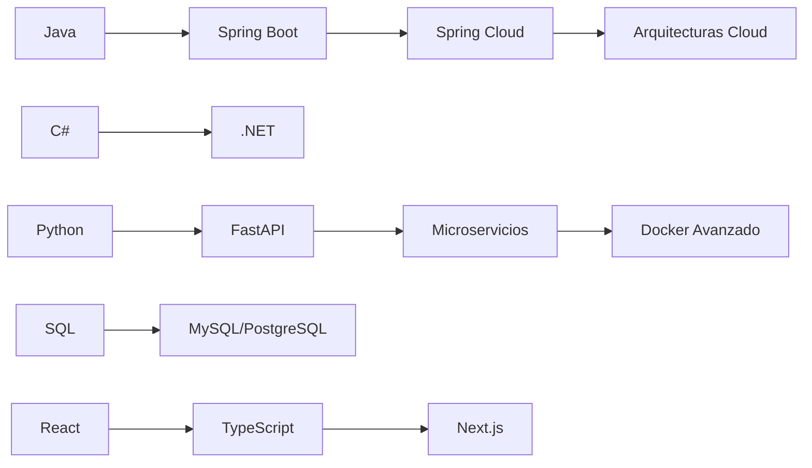

# ¡Hola Mundo! 👋 Soy Brian Battauz 🚀

## 👨‍💻 Sobre mí  
Apasionado **Backend Developer** con foco en Java y C#, ahora expandiendo mis horizontes al mundo Full Stack.  
✨ **Mi mantra**: *"Código limpio, arquitecturas sólidas y aprendizaje continuo"*  

---

## 🛠️ Tech Stack  

### 🔧 Backend  

### 🎨 Frontend (En aprendizaje)  

### 🗃️ Bases de Datos  

### ⚙️ DevOps & Otros  

---

## 🏆 Proyectos Destacados  

### 🛒 [API Gestión de Clientes/Pedidos](https://github.com/Brian13b/SistemaGestionClientesPedidosAPI)  
_API REST en C#/.NET con arquitectura en capas_  
✔️ Entity Framework ✔️ Swagger ✔️ Patrón Repository  

### 🎾 [ReservAPP](https://github.com/Brian13b/ReservaCanchaPadel)  
_Sistema fullstack (FastAPI + React) para reservas de pádel_  
🔥 JWT Auth 🔥 PostgreSQL 🔥 SQLAlchemy  

### ✅ [Task API](https://github.com/Brian13b/tasks-api.git)  
_ToDo App con Spring Boot + JWT_  
🔐 Spring Security 🧩 DTO Pattern 📦 MySQL  

---

## 🚀 Mi Roadmap de Aprendizaje  

---

## 📫 ¡Conectemos!  

---

## 📚 Siempre Aprendiendo  
_"El conocimiento es el único recurso que aumenta cuando se comparte"_  
🔭 Actualmente explorando: **Microservicios | AWS | Kubernetes** 

